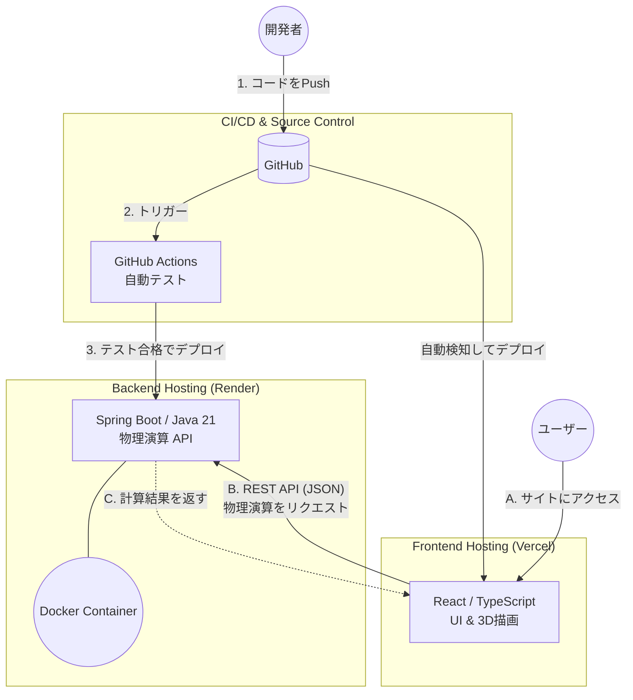

# ダーツ物理シミュレーター (バックエンドAPI)

*他の言語で読む: [English](README.md), [日本語](README.ja.md)*

ダーツ物理シミュレーターのコアとなる物理演算エンジンおよびREST APIバックエンドです。**Java 21** と **Spring Boot** で構築されており、ダーツの軌道、空気抵抗、重量配分などの複雑な計算を処理し、フロントエンドUIに対して高速で信頼性の高いAPIを提供します。

🔗 **フロントエンドリポジトリ:** [darts-sim-web](https://github.com/your-username/darts-sim-web)
🚀 **本番APIエンドポイント:** `https://your-api.onrender.com/api/hello` *(※ご自身のRenderのURLに変更してください)*

---

## ⚙️ 主な機能

- **物理演算エンジン:** バレルの重量、シャフトの長さ、フライトの空気抵抗などのパラメータに基づいてダーツの飛行軌道を計算します。
- **RESTful API:** クライアントへ計算データを提供するための、クリーンで疎結合なエンドポイントを提供します。
- **コンテナ化アーキテクチャ:** マルチステージビルドによる完全なDocker化を行い、ローカルから本番環境まで一貫した軽量な実行環境を保証します。
- **自動化されたCI/CD:** GitHub Actionsによる自動テストとシームレスなデプロイメントパイプライン。

## 🛠 技術スタック

- **言語:** Java 21
- **フレームワーク:** Spring Boot 3
- **ビルドツール:** Maven
- **コンテナ化:** Docker
- **ホスティング/デプロイ:** Render

---

## 🏗 システムアーキテクチャ

UIの描画処理と、重い物理演算を分離するための疎結合アーキテクチャを採用しています。



---

## 🚀 ローカル環境の構築手順

### 前提条件

ローカルマシンに以下がインストールされていることを確認してください。
- **Java 21 (JDK)**
- **Maven** (Maven Wrapperが同梱されているため任意)
- **Docker** (コンテナ環境で実行する場合のみ)

### インストールと起動

1. リポジトリをクローンします:
```bash
   git clone [https://github.com/your-username/darts-sim-api.git](https://github.com/your-username/darts-sim-api.git)
   cd darts-sim-api
   ```

2. Maven Wrapperを使用してアプリケーションを起動します:
```bash
   ./mvnw spring-boot:run
   ```
   *(Windowsの場合は `mvnw.cmd spring-boot:run` を使用)*

3. APIサーバーが `http://localhost:8080` で起動します。

### Dockerでの実行 (ローカル)

Dockerコンテナとしてビルドおよび実行する場合は以下のコマンドを実行します。

```bash
# Dockerイメージのビルド
docker build -t darts-sim-api .

# コンテナの起動
docker run -p 8080:8080 darts-sim-api
```

---

## 📈 CI/CDとデプロイ

- **本番環境:** `main` ブランチへPushされると、Dockerコンテナとして **Render** へ自動的にデプロイされます。
- **ヘルスチェック:** `/api/hello` エンドポイントにより、サービスの稼働状態と応答性を確認できます。
