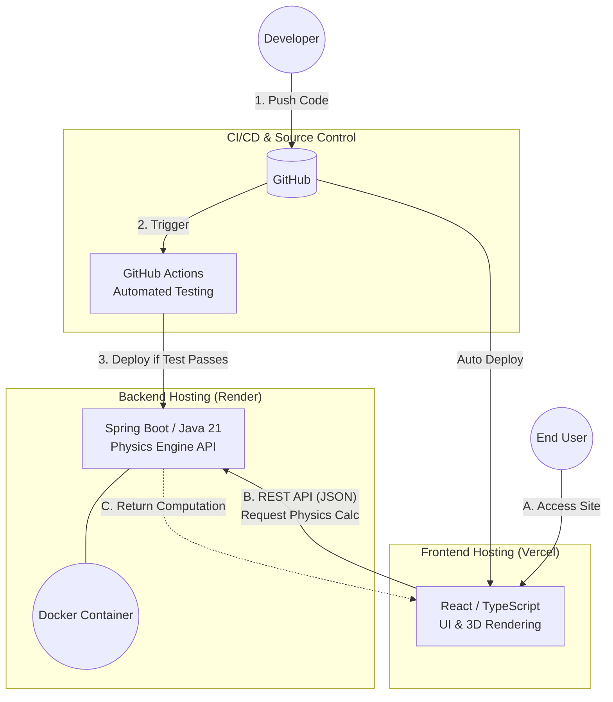

# Darts Physics Simulator (Backend API)

*Read this in other languages: [English](README.md), [日本語](README.ja.md)*

The core physics engine and REST API backend for the Darts Physics Simulator. Built with **Java 21** and **Spring Boot**, it handles complex computations such as dart trajectories, aerodynamics, and weight distribution, providing a fast and reliable API for the frontend UI.

🔗 **Frontend Repository:** [darts-sim-web](https://github.com/your-username/darts-sim-web)
🚀 **Live API Endpoint:** `https://your-api.onrender.com/api/hello` *(Replace with your actual Render URL)*

---

## ⚙️ Core Features

- **Physics Simulation Engine:** Calculates dart flight paths based on various parameters (barrel weight, shaft length, flight drag, etc.).
- **RESTful API:** Provides clean, decoupled endpoints to serve calculation data to the client.
- **Containerized Architecture:** Fully Dockerized using multi-stage builds to ensure consistent and lightweight environments from local development to production.
- **Automated CI/CD:** GitHub Actions pipeline for automated testing and seamless deployment.

## 🛠 Tech Stack

- **Language:** Java 21
- **Framework:** Spring Boot 3
- **Build Tool:** Maven
- **Containerization:** Docker
- **Hosting/Deployment:** Render

---

## 🏗 System Architecture

This application adopts a decoupled architecture to isolate user interface concerns from heavy physics computations.



---

## 🚀 Getting Started

### Prerequisites

Ensure you have the following installed on your local machine:
- **Java 21 (JDK)**
- **Maven** (Optional, as the project includes the Maven Wrapper)
- **Docker** (Optional, for containerized execution)

### Installation & Local Development

1. Clone the repository:
```bash
   git clone [https://github.com/your-username/darts-sim-api.git](https://github.com/your-username/darts-sim-api.git)
   cd darts-sim-api
   ```

2. Run the application using the Maven Wrapper:
```bash
   ./mvnw spring-boot:run
   ```
   *(On Windows, use `mvnw.cmd spring-boot:run`)*

3. The API will start on `http://localhost:8080`.

### Running with Docker (Local)

To build and run the application inside a Docker container:

```bash
# Build the Docker image
docker build -t darts-sim-api .

# Run the container
docker run -p 8080:8080 darts-sim-api
```

---

## 📈 CI/CD & Deployment

- **Production Deployment:** Automatically deployed as a Docker container to **Render** on every push to the `main` branch.
- **Health Check:** `/api/hello` endpoint ensures the service is active and responsive.
